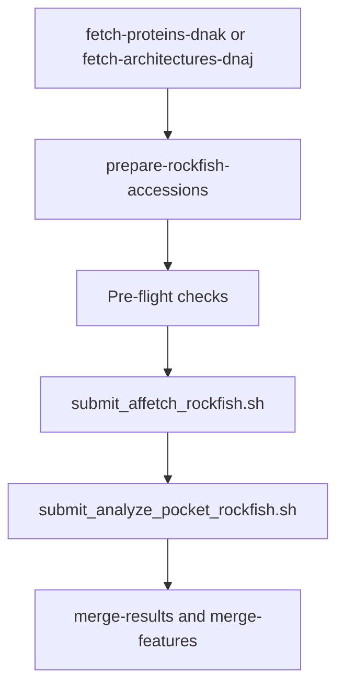

# JHU BioREU JDP Classification Project

The project goal is building a **protein ID system** for J-domain proteins. Instead of saying “this unknown protein kind of looks like something from *E. coli* or humans,” we want a systematic way to look at its parts and predict what job it probably does in the Hsp70 chaperone system ([FEBS review](https://febs.onlinelibrary.wiley.com/doi/10.1111/febs.70359)).

## Core background

Proteins are chains of amino acids that fold into 3D shapes. Those shapes let proteins do cellular jobs: catalyzing reactions, carrying signals, building structures, or binding other molecules.

Sometimes proteins fold incorrectly, partly unfold, or clump together. **Chaperones** are helper proteins that prevent this damage or help proteins recover ([PubMed](https://pubmed.ncbi.nlm.nih.gov/35729039/)).

**Hsp70** is one of the most important chaperones. It works like a reusable clamp: it grabs exposed sticky parts of proteins, uses ATP energy, and releases them so they get another chance to fold correctly ([FEBS review](https://febs.onlinelibrary.wiley.com/doi/10.1111/febs.70359)).

**J-domain proteins (JDPs)**, of which Hsp40 is a famous example, tell Hsp70 where to act. Hsp70 is the powerhouse; JDPs provide much of the targeting logic ([bioRxiv](https://www.biorxiv.org/content/10.1101/2024.10.15.618527v1.full.pdf)). JDPs recognize misfolded, unfolded, or aggregating proteins and recruit **ATP-bound Hsp70**. In the ATP-bound state, Hsp70’s **nucleotide-binding domain (NBD)** and **substrate-binding domain (SBD)** are tightly coupled; contact with the J-domain stimulates ATP hydrolysis so Hsp70 can grip and release client proteins in a controlled cycle ([FEBS review](https://febs.onlinelibrary.wiley.com/doi/10.1111/febs.70359)).

## Acronym guide

| Acronym | Meaning | Simple meaning |
|---------|---------|----------------|
| JDP | J-domain protein | A protein that helps Hsp70 work. |
| JD | J-domain | The small part of a JDP that contacts Hsp70. |
| Hsp70 | Heat shock protein 70 | A major chaperone that helps proteins fold or recover. |
| Hsp40 | Heat shock protein 40 | Older/common name for many JDPs. |
| DnaK | Bacterial Hsp70 | The *E. coli* version of Hsp70. |
| DnaJ | Bacterial JDP/Hsp40 | The classic JDP used as the reference model. |
| ATP | Adenosine triphosphate | The cell’s energy currency. |
| ADP | Adenosine diphosphate | The lower-energy product after ATP is used. |
| NEF | Nucleotide exchange factor | A protein that helps Hsp70 reset for another cycle. |
| HPD | Histidine-proline-aspartate | A key three-amino-acid motif in real J-domains. |
| G/F-rich | Glycine/phenylalanine-rich | A flexible region common in class A and B JDPs. |
| DNAJA | Class A human-style JDP group | DnaJ-like JDPs with many classic domains. |
| DNAJB | Class B human-style JDP group | J-domain plus G/F-rich region but less complete DnaJ-like architecture. |
| DNAJC | Class C human-style JDP group | Very diverse JDPs that do not fit class A or B. |
| ER | Endoplasmic reticulum | A cell compartment where secreted and membrane proteins fold. |
| TM | Transmembrane | A protein segment that crosses a membrane. |
| TPR | Tetratricopeptide repeat | A repeated protein-binding module found in some chaperone-related proteins. |
| DUF | Domain of unknown function | A predicted domain whose job is not yet well understood. |
| HMM | Hidden Markov model | A computational pattern detector used to find protein domains. |
| Pfam / InterPro | Protein domain databases | Tools/databases used to label domains in protein sequences. |

Key references for this section: [FEBS review](https://febs.onlinelibrary.wiley.com/doi/10.1111/febs.70359), [bioRxiv preprint](https://www.biorxiv.org/content/10.1101/2024.10.15.618527v1.full.pdf), [PubMed](https://pubmed.ncbi.nlm.nih.gov/35729039/).

## What a domain is

A **domain** is a reusable part of a protein, think of it like a LEGO block with a specific shape and job.

A protein’s **domain architecture** is which domains it has and in what order. For JDPs this matters because the J-domain activates Hsp70, while other domains often decide which substrates the JDP recognizes, where it localizes, and which pathway it joins ([bioRxiv](https://www.biorxiv.org/content/10.1101/2024.10.15.618527v1.full.pdf)).

This project is not only asking “Does this protein have a J-domain?” It asks **“What kind of JDP is this, based on the full layout of its components?”**

## JDP classes

The simplest classification is **class A**, **class B**, and **class C**, based on similarity to classic bacterial DnaJ ([FEBS review](https://febs.onlinelibrary.wiley.com/doi/10.1111/febs.70359)).

| Class | Simple signature | Simple interpretation |
|-------|------------------|----------------------|
| Class A / DNAJA | N-terminal J-domain, G/F-rich region, client-binding domains, zinc-finger-like region, and dimerization region | Most similar to classic DnaJ; often a general protein-folding helper. |
| Class B / DNAJB | N-terminal J-domain and G/F-rich region but lacks some class A features (especially the zinc-finger-like region) | Similar to class A, but often more specialized. |
| Class C / DNAJC | J-domain present but architecture does not match class A or B | A large mixed category; often specialized for particular pathways. |

Treat “class C” cautiously: it groups many specialized JDPs that are not yet fully subdivided ([FEBS review](https://febs.onlinelibrary.wiley.com/doi/10.1111/febs.70359)).

## Classifier goals

The long-term goal is an **unbiased classifier** — one that does not rely only on classic model organisms (*E. coli*, yeast, humans) but can handle unfamiliar proteins from non-model species ([bioRxiv](https://www.biorxiv.org/content/10.1101/2024.10.15.618527v1.full.pdf)).

For each protein, the classifier should eventually answer:

- Does it have a real J-domain?
- Does the J-domain contain the important HPD motif?
- Where is the J-domain: beginning, middle, or end?
- Does it have a G/F-rich region?
- Does it have client-binding domains?
- Does it have membrane-spanning regions?
- Does it have signal peptides that target a compartment?
- Does it resemble class A, class B, class C, or a more specific subclass?
- Is the classification high-confidence or uncertain?

A useful output goes beyond “class C”. For example: “High-confidence membrane-associated class C JDP with an HPD-containing J-domain and a transmembrane segment, likely recruiting Hsp70 to a membrane-localized process” ([FEBS review](https://febs.onlinelibrary.wiley.com/doi/10.1111/febs.70359)).

JDPs customize where and how Hsp70 acts: newly made proteins, damaged proteins, aggregates, membranes, organelles, ribosomes, or degradation pathways ([PubMed](https://pubmed.ncbi.nlm.nih.gov/35729039/)).

## Data fetching

This repository’s current code collects reference and homolog data from [InterPro](https://www.ebi.ac.uk/interpro/) for the bacterial JDP and Hsp70 entries used as anchors in the classification work:

| Script | InterPro entry | Description |
|--------|----------------|-------------|
| `fetch-architectures-dnaj` | IPR001623 (DnaJ/HSP40) | Fetches proteins for the top *N* domain architectures |
| `fetch-proteins-dnak` | IPR012725 (DnaK) | Fetches all proteins for a single entry (no architecture groups) |

Both scripts write JSON output to disk. No deduplication is performed, so proteins are stored exactly as returned by the API.
## Requirements

- Python **3.12+**
- Network access to `www.ebi.ac.uk`

## Installation

Clone the repository and install the package in **editable** mode so local code changes take effect immediately and console commands are registered.

### pip (recommended)

```bash
pip install -e ".[dev]"
```

The `[dev]` extra installs pytest and pytest-asyncio for running the test suite.

### Make

On Linux or macOS:

```bash
make install
```

This runs `pip install -e ".[dev]"`.

### Conda

```bash
conda env create -f environment.yaml
conda activate reu_project
pip install -e .
```

The conda environment installs runtime and test dependencies via pip. Run `pip install -e .` afterward to register the package and console commands.

## Running the fetch scripts

After installation, use the console commands:

```bash
fetch-proteins-dnak --help
fetch-architectures-dnaj --help
extract-uniprot-ids --help
prepare-rockfish-accessions --help
merge-features --help
merge-all-features --help
classify-jdp --help
analyze-pocket-charge --help
```

Without installing, you can run the modules directly from the project root:

```bash
python -m data_fetching.fetch_proteins_dnak --help
python -m data_fetching.fetch_architectures_dnaj --help
```

### fetch-proteins-dnak (IPR012725 / DnaK)

Fetches all proteins matching InterPro entry IPR012725.

```bash
fetch-proteins-dnak
```

**Default output:** `ipr012725_proteins.json`

| Flag | Description | Default |
|------|-------------|---------|
| `-p`, `--page-size` | Results per API page | `200` |
| `-o`, `--output` | Output JSON file path | `ipr012725_proteins.json` |
| `-k`, `--checkpoint` | Checkpoint file for resume | `ipr012725_checkpoint.json` |
| `-m`, `--max-percent` | Percent threshold for soft count notification | `0.01` (1%) |
| `-a`, `--max-abs` | Absolute threshold for hard count warning | `100` |
| `-t`, `--timeout` | Request timeout in seconds | `300` |

**Checkpoint / resume:** If a fetch is interrupted (for example by a timeout mid-pagination), progress is saved to the checkpoint file. Re-run the same command to resume from the last cursor. The checkpoint file is deleted automatically when the fetch completes successfully.

**Example:**

```bash
fetch-proteins-dnak -o my_proteins.json -t 600
```

### fetch-architectures-dnaj (IPR001623 / DnaJ)

Fetches proteins for the first *N* domain architecture groups of IPR001623. Proteins that appear in multiple architectures are stored multiple times; each record is flagged with `appears_in_architecture_count`.

```bash
fetch-architectures-dnaj
```

**Default output:** `ipr001623_domain_architectures_no_dedup.json`

| Flag | Description | Default |
|------|-------------|---------|
| `-n`, `--n-architectures` | Number of architectures to fetch | `20` |
| `-u`, `--arch-url` | Custom architecture list API URL | InterPro IPR001623 endpoint |
| `-c`, `--concurrency` | Max concurrent architecture fetches | `5` |
| `-o`, `--output` | Output JSON file path | `ipr001623_domain_architectures_no_dedup.json` |

**Example:**

```bash
fetch-architectures-dnaj -n 10 -o my_architectures.json
```

## Output format

### DnaK (`fetch-proteins-dnak`)

```json
{
  "entry_accession": "IPR012725",
  "proteins_reported": 100000,
  "total_proteins_fetched": 100000,
  "is_partial": false,
  "proteins": [],
  "note": "..."
}
```

### DnaJ (`fetch-architectures-dnaj`)

```json
{
  "architectures": [
    {
      "ida": "PF00226:IPR001623",
      "ida_id": "...",
      "unique_proteins_reported": 98256,
      "proteins_fetched": 99077,
      "is_partial": false,
      "proteins": [{"appears_in_architecture_count": 2}]
    }
  ],
  "total_proteins_fetched": 225610,
  "note": "..."
}
```

Fetched JSON files are gitignored by default.

## Rockfish pipeline (end-to-end)

Run these steps on a Rockfish login node after installing this repo (`pip install -e ".[dev,structure]"`). **Always use the `submit_*_rockfish.sh` launchers** — do not call `affetch_rockfish.sh` or `analyze_pocket_rockfish.sh` directly (they require a submit-time accession snapshot).



### 0. One-time setup

```bash
export WK_DIR="${HOME}/scr4_sfried3/alphafoldfetch"
export PROJECT_DIR="${HOME}/repositories/20260601_reu_project"
cd "${PROJECT_DIR}"

# AlphaFoldFetch
conda env create -f scripts/slurm/conda_env.yaml -p "${HOME}/affetch"

# Pocket charge (after cloning repo on Rockfish)
conda env create -f scripts/slurm/conda_env_pocket.yaml -p "${HOME}/pocket"
conda activate "${HOME}/pocket"
pip install -e ".[structure]"
```

### 1. Fetch from InterPro (login node or local)

**DnaK** (one protein list per entry):

```bash
fetch-proteins-dnak -o ipr012725_proteins.json
```

**DnaJ** (proteins grouped by architecture; same accession may appear in multiple architectures):

```bash
fetch-architectures-dnaj -o ipr001623_domain_architectures_no_dedup.json
```

### 2. Prepare accession queue (required before every array job)

Run **once after each fetch**. This dedupes accessions, validates raw vs unique counts, and writes `${WK_DIR}/incomplete_accessions.txt` (one unique ID per line).

```bash
# DnaK example
prepare-rockfish-accessions ipr012725_proteins.json --wk-dir "${WK_DIR}"

# DnaJ example
prepare-rockfish-accessions ipr001623_domain_architectures_no_dedup.json --wk-dir "${WK_DIR}"
```

Stderr reports `raw_records`, `unique_accessions`, and `duplicate_records_skipped`. For DnaJ, duplicate instances across architectures are **expected**; the Rockfish queue uses unique IDs only.

`extract-uniprot-ids` is still available for quick extraction to stdout or a local file; use `prepare-rockfish-accessions` for Rockfish.

### 3. Pre-flight checks (before spending SLURM hours)

```bash
# Unique accession count
wc -l "${WK_DIR}/incomplete_accessions.txt"

# Must print nothing (no duplicate lines)
sort "${WK_DIR}/incomplete_accessions.txt" | uniq -d

# Optional: inspect fetch vs unique counts again
prepare-rockfish-accessions ipr012725_proteins.json --wk-dir "${WK_DIR}"
```

Do **not** manually `cp` or append to `incomplete_accessions.txt` — duplicates and overlapping array jobs were the main cause of repeated downloads. Re-run `prepare-rockfish-accessions` after any new fetch.

### 4. Download structures (affetch array)

```bash
cd "${PROJECT_DIR}"
bash scripts/slurm/submit_affetch_rockfish.sh
```

The launcher dedupes the input, writes a **fixed snapshot** to `${WK_DIR}/array_queues/affetch_<timestamp>.txt`, and passes it to workers as `ARRAY_QUEUE_FILE`. Each array task ID maps to **one line** in that snapshot for the life of the job. Tasks skip accessions already in `completed_accessions.txt` or when `AF-<accession>-F1-model_v6.pdb.gz` (or `.pdb`) already exists.

Re-submit the launcher to process the next batch of pending accessions (up to 10,000 per submission).

Pilot tip: `export ARRAY_CONCURRENCY=10` and test on a small fetch before scaling.

### 5. Pocket charge array

Prerequisites: affetch finished; `AF-P0A6Y8-F1-model_v6.pdb.gz` present in `${WK_DIR}/structures/`.

```bash
bash scripts/slurm/submit_analyze_pocket_rockfish.sh
```

Same snapshot/dedupe/locking behavior as affetch. Output: `${WK_DIR}/pocket_results/pocket_charge_<accession>.json`. Completed IDs: `completed_pocket.txt`.

### 6. Merge and join features (login node)

```bash
conda activate "${HOME}/pocket"
cd "${PROJECT_DIR}"

analyze-pocket-charge --merge-results "${WK_DIR}/pocket_results" \
  --output-dir "${WK_DIR}/pocket_results" \
  --min-mapping-confidence high

merge-features ipr012725_proteins.json \
  --pocket-csv "${WK_DIR}/pocket_results/pocket_charge_summary.csv" \
  -o "${WK_DIR}/merged_features/dnak_with_pocket.csv"
```

For DnaJ classifications and a unified table, see [Unified feature table](#unified-feature-table-merge-all-features) (`merge-all-features`).

### Work directory layout

| Path | Purpose |
|------|---------|
| `${WK_DIR}/incomplete_accessions.txt` | Master deduped accession list (from `prepare-rockfish-accessions`) |
| `${WK_DIR}/array_queues/*.txt` | Fixed per-submission snapshots (do not edit) |
| `${WK_DIR}/completed_accessions.txt` | Affetch finished IDs |
| `${WK_DIR}/failed_accessions.txt` | Affetch failures (retry candidates) |
| `${WK_DIR}/completed_pocket.txt` | Pocket analysis finished IDs |
| `${WK_DIR}/structures/` | AlphaFold PDB/CIF files from affetch |
| `${WK_DIR}/pocket_results/` | Per-accession pocket JSON + summary CSV |
| `${WK_DIR}/logs/` | SLURM stdout/stderr per array task |

### Troubleshooting duplicate or repeated jobs

If the same accession was downloaded or analyzed multiple times (e.g. overlapping array submissions or duplicate lines in the input file):

1. Backup and dedupe completion logs: `sort -u -o completed_accessions.txt completed_accessions.txt` (same for `completed_pocket.txt` if needed).
2. Re-run `prepare-rockfish-accessions <fetch.json> --wk-dir "${WK_DIR}"` to refresh the master input.
3. Submit only via `submit_*_rockfish.sh` (never re-run worker scripts from an old job ID).
4. Confirm `sort incomplete_accessions.txt | uniq -d` prints nothing before the next large submission.

---

## AlphaFold structure download (Rockfish + AlphaFoldFetch)

After fetching proteins from InterPro, you can download predicted structures from the [AlphaFold Database](https://alphafold.ebi.ac.uk/) using [AlphaFoldFetch](https://github.com/mansanlab/alphafoldfetch) (`affetch`).

### 1. Extract and prepare UniProt accessions

Run this **once after each InterPro fetch** (DnaK or DnaJ). It dedupes accessions, validates counts against the fetch JSON, and installs the Rockfish input file.

```bash
WK_DIR="${HOME}/scr4_sfried3/alphafoldfetch"
fetch-proteins-dnak -o ipr012725_proteins.json
prepare-rockfish-accessions ipr012725_proteins.json --wk-dir "${WK_DIR}"
```

For DnaJ architectures (many duplicate instances across architectures are collapsed to unique IDs):

```bash
fetch-architectures-dnaj -o ipr001623_domain_architectures_no_dedup.json
prepare-rockfish-accessions ipr001623_domain_architectures_no_dedup.json --wk-dir "${WK_DIR}"
```

`prepare-rockfish-accessions` writes `${WK_DIR}/incomplete_accessions.txt` with **one unique accession per line**. It prints raw vs unique counts so you can confirm DnaK/DnaJ extraction before spending SLURM hours.

`extract-uniprot-ids` remains available for quick stdout/file extraction with the same dedupe logic.

### 2. Set up AlphaFoldFetch on Rockfish (once)

```bash
conda env create -f scripts/slurm/conda_env.yaml -p "${HOME}/affetch"
conda activate "${HOME}/affetch"
```

### 3. Work directory layout

`prepare-rockfish-accessions` creates `${WK_DIR}/incomplete_accessions.txt`. Do **not** manually append duplicate lines to this file. Re-run `prepare-rockfish-accessions` after a new fetch.

The submit launcher dedupes the input again, writes a **fixed snapshot** under `${WK_DIR}/array_queues/`, and passes it to each array task via `ARRAY_QUEUE_FILE`. This prevents the same accession from being assigned to multiple task IDs when jobs overlap or completion logs change mid-run.

### 4. Submit the SLURM array job

```bash
bash scripts/slurm/submit_affetch_rockfish.sh
```

The launcher writes a snapshot of pending accessions and submits `sbatch --array=1-N%128` against that fixed list.

| Variable | Default | Description |
|----------|---------|-------------|
| `WK_DIR` | `${HOME}/scr4_sfried3/alphafoldfetch` | Work directory for inputs, logs, and structures |
| `PROJECT_DIR` | `${HOME}/repositories/20260601_reu_project` | Path to this repository on Rockfish |
| `ARRAY_QUEUE_FILE` | (set by launcher) | Fixed accession snapshot for this array job |
| `SLURM_ACCOUNT` | (from job script) | Override SLURM account at submit time, e.g. `export SLURM_ACCOUNT=your_account` |
| `ARRAY_CONCURRENCY` | `128` | Max concurrent array tasks (`%` cap in `sbatch --array`) |
| `FILE_TYPE` | `pcz` | `affetch -f` format: `p`=PDB, `c`=CIF, `z`=gzip |
| `MODEL_VERSION` | `6` | AlphaFold model version |
| `CONDA_ENV` | `${HOME}/affetch` | Conda env path for affetch |

Each array task downloads **one** accession from its snapshot line. Tasks skip work when the accession is already in `completed_accessions.txt` or the structure file already exists (no overwrite). Completion logging uses file locks to avoid duplicate log lines. Failed downloads go to `failed_accessions.txt`. Re-submit via the launcher to process the next snapshot batch.

Structures are written to `${WK_DIR}/structures/` as `AF-<accession>-F1-model_v6.pdb.gz` (and `.cif.gz` by default).

## Rockfish pocket-charge batch

After affetch completes, run binding-pocket charge analysis at scale with a SLURM array job (one accession per task). Results land in `${WK_DIR}/pocket_results/` as `pocket_charge_<accession>.json`.

### Prerequisites

- Structures downloaded via affetch (`${WK_DIR}/structures/`)
- Reference structure `P0A6Y8` present as `AF-P0A6Y8-F1-model_v6.pdb.gz` in `${WK_DIR}/structures/`
- Same `incomplete_accessions.txt` used for affetch

### 1. Create the `pocket` conda environment (once)

```bash
conda env create -f scripts/slurm/conda_env_pocket.yaml -p "${HOME}/pocket"
conda activate "${HOME}/pocket"
cd "${PROJECT_DIR}"
pip install -e ".[structure]"
```

### 2. Submit the array job

```bash
bash scripts/slurm/submit_analyze_pocket_rockfish.sh
```

The launcher writes a fixed snapshot and submits `sbatch --array=1-N%128`. Same dedupe/snapshot/locking behavior as affetch.

| Variable | Default | Description |
|----------|---------|-------------|
| `WK_DIR` | `${HOME}/scr4_sfried3/alphafoldfetch` | Shared work directory with affetch |
| `PROJECT_DIR` | `${HOME}/repositories/20260601_reu_project` | Repo checkout on Rockfish |
| `RESULTS_DIR` | `${WK_DIR}/pocket_results` | Per-accession JSON output |
| `REFERENCE_ACCESSION` | `P0A6Y8` | Reference AlphaFold structure for alignment |
| `ARRAY_CONCURRENCY` | `128` | Max concurrent array tasks |
| `CONDA_ENV` | `${HOME}/pocket` | Conda env path with structure extras |

Completed accessions are logged to `completed_pocket.txt`; failures to `failed_pocket.txt`. Re-submitting skips finished IDs. Tasks skip if output JSON already exists.

### 3. Merge results and join with InterPro fetch

On a login node after the array completes:

```bash
conda activate "${HOME}/pocket"
cd "${PROJECT_DIR}"
analyze-pocket-charge --merge-results "${WK_DIR}/pocket_results" \
  --output-dir "${WK_DIR}/pocket_results" \
  --min-mapping-confidence high
merge-features ipr012725_proteins.json \
  --pocket-csv "${WK_DIR}/pocket_results/pocket_charge_summary.csv" \
  -o "${WK_DIR}/merged_features/dnak_with_pocket.csv"
```

Use `--min-mapping-confidence high` (not `--min-confidence high`) when screening for charge-inversion candidates: yeast-like homologs can have high mapping but low combined tier due to divergent contact sequences.

Pilot tip: set `ARRAY_CONCURRENCY=10` and test on a small pending subset before scaling to the full DnaK fetch.

## Binding-pocket charge analysis (v4)

Measure net charge at the **DnaK/Hsp70 SBD peptide-binding pocket** on AlphaFold models. The pocket is defined from PDB [1DKX](https://www.rcsb.org/structure/1DKX) (peptide-contact residues within 8 Å) and transferred to each homolog by **SBD-domain alignment**. This tests the working hypothesis that some DnaK homologs show electrostatic differences (“charge inversion”) relative to *E. coli* DnaK (`P0A6Y8`).

**v4 improvements** over v3:

- **Two-axis confidence** — `mapping_confidence` (structural/SBD placement) separate from `conservation_score` (contact sequence similarity).
- **Structure-guided validation** — Kabsch SBD superposition, per-contact Cα distances, and rotation-invariant `contact_drmsd`.
- **Smart fallback** — when AlphaFold models cannot be superposed (SBD RMSD ≥10 Å), mapping tier uses SBD-domain alignment quality instead of penalizing expected sequence divergence.
- **`charge_inversion_candidate` flag** — mapping high + conservation low + |contact Δ| ≥ 2.

v3 features retained: SBD-domain alignment, per-contact attribution, histidine/burial metrics, sensitivity sweep, 1DKX validation ([`docs/pocket_validation.md`](docs/pocket_validation.md)).

### Install structure dependencies

```bash
pip install -e ".[structure]"
```

(`scipy` is required for spatial shell expansion.)

### Dev structures (local, not committed)

Download a handful of AlphaFold PDBs into `data/dev_structures/` (gitignored):

| Accession | Role |
|-----------|------|
| `P0A6Y8` | *E. coli* DnaK reference |
| `P11142` | Human HSPA8 |
| `P08113` | Yeast HSP70 |
| `P61889` | *T. thermophilus* DnaK |
| `P42943` | Plant HSP70 |

Example download:

```bash
curl -o data/dev_structures/AF-P0A6Y8-F1-model_v6.pdb \
  https://alphafold.ebi.ac.uk/files/AF-P0A6Y8-F1-model_v6.pdb
```

### Run analysis

Single structure:

```bash
analyze-pocket-charge data/dev_structures/AF-P0A6Y8-F1-model_v6.pdb \
  --reference-pocket data/pocket_refs/dnak_sbd_pocket.yaml \
  -o pocket_charge_P0A6Y8.json
```

Export per-residue pocket membership or per-contact charge attribution:

```bash
analyze-pocket-charge data/dev_structures/AF-P08113-F1-model_v6.pdb \
  --export-pocket-residues pocket_residues_P08113.csv \
  --export-contact-attribution contact_attribution_P08113.csv
```

Batch (dev set):

```bash
analyze-pocket-charge data/dev_structures --batch --output-dir data/pocket_charge_results
```

Parameter sensitivity sweep:

```bash
analyze-pocket-charge data/dev_structures --sensitivity --output-dir data/pocket_charge_results
```

Filter the CSV/summary to medium combined confidence or above:

```bash
analyze-pocket-charge data/dev_structures --batch --output-dir data/pocket_charge_results \
  --min-confidence medium
```

For charge-inversion screening, filter on **mapping** confidence only (keeps high-mapping / low-conservation candidates):

```bash
analyze-pocket-charge data/dev_structures --batch --output-dir data/pocket_charge_results \
  --min-mapping-confidence high
```

Merge existing per-accession JSON files into a summary CSV (e.g. after Rockfish array jobs):

```bash
analyze-pocket-charge --merge-results data/pocket_charge_results \
  --output-dir data/pocket_charge_results \
  --min-mapping-confidence high
```

Both `--min-confidence` and `--min-mapping-confidence` can be combined (AND logic). Per-accession JSON is always written in batch mode; filters apply only to `pocket_charge_summary.csv` / `.json`.

### Merge with InterPro fetch (classifier bridge)

Join InterPro fetch JSON with `pocket_charge_summary.csv` on UniProt accession to build a flat feature table for downstream classifier work. The primary workflow is **DnaK fetch + pocket CSV**; pocket charge is DnaK SBD-specific, so DnaJ rows usually have `has_pocket_charge=false` unless that accession was analyzed separately.

```bash
merge-features ipr012725_proteins.json \
  --pocket-csv data/pocket_charge_results/pocket_charge_summary.csv \
  -o data/merged_features/dnak_with_pocket.csv
```

Use `--join inner` to keep only proteins with pocket metrics. For hypothesis-driven subsets (e.g. charge-inversion candidates), filter on `mapping_confidence=high` rather than the conservative combined `confidence_tier`.

DnaJ architecture fetch (one row per accession by default):

```bash
merge-features ipr001623_domain_architectures_no_dedup.json \
  --pocket-csv data/pocket_charge_results/pocket_charge_summary.csv \
  -o data/merged_features/dnaj_with_pocket.csv
```

Use `--dnaj-rows explode` for one row per (accession, architecture).

| Column | Meaning |
|--------|---------|
| `fetch_source` | `dnak` or `dnaj` (auto-detected from JSON shape) |
| `architecture_ida` | DnaJ domain architecture label(s); semicolon-joined in dedupe mode |
| `has_pocket_charge` | `true` when accession appears in pocket CSV |
| `charge_inversion_candidate` | Derived from `quality_flags` |
| `merge_warnings` | Reserved for per-row merge notes |

### Unified feature table (`merge-all-features`)

Join **all** pipeline outputs on UniProt accession into one flat CSV for downstream analysis. Any subset of inputs may be provided; at least one is required.

```bash
merge-all-features \
  --dnak-json ipr012725_proteins.json \
  --dnaj-json ipr001623_domain_architectures_no_dedup.json \
  --pocket-csv data/pocket_charge_results/pocket_charge_summary.csv \
  --jdp-csv data/jdp_classifications/jdp_classifications.csv \
  -o data/merged_features/all_features.csv
```

DnaK-only + pocket (subset merge):

```bash
merge-all-features \
  --dnak-json ipr012725_proteins.json \
  --pocket-csv data/pocket_charge_results/pocket_charge_summary.csv \
  -o data/merged_features/dnak_pocket.csv
```

| Flag | Purpose |
|------|---------|
| `--join outer` | Union of accessions across provided inputs (default) |
| `--join inner` | Keep only rows present in **every** provided input |

| Column | Meaning |
|--------|---------|
| `fetch_sources` | Semicolon-separated `dnak` / `dnaj` when accession appears in those fetch files |
| `dnaj_architecture_ida` | DnaJ architecture label(s) from `--dnaj-json` (deduped per accession) |
| `pocket_quality_flags` | Pocket `quality_flags` renamed to avoid clash with JDP flags |
| `jdp_predicted_class` | Class A/B/C from `classify-jdp` |
| `jdp_has_gf_rich` | G/F-rich Pfam (`PF09320`) in architecture |
| `jdp_has_transmembrane` | TM evidence from InterPro or UniProt |
| `jdp_has_signal_peptide` | Signal peptide evidence |
| `jdp_layout_tags` | Biological layout tags (e.g. `membrane_associated`) |
| `has_pocket_charge` | `true` when accession appears in `--pocket-csv` |
| `has_jdp_classification` | `true` when accession appears in `--jdp-csv` |
| `charge_inversion_candidate` | Derived from pocket `quality_flags` |

Identity fields (`protein_name`, `protein_length`, `source_database`) resolve in order: DnaK fetch → DnaJ fetch → JDP CSV. Pocket-only rows keep accession with empty identity unless JDP is also provided.

`merge-features` remains the simpler DnaK/DnaJ + pocket join; use `merge-all-features` when JDP classifications are part of the table.

### JDP classifier v1

Rule-based **class A / B / C** prediction from DnaJ architecture fetch JSON, plus **HPD motif** detection, **G/F-rich** architecture flags, **transmembrane/signal-peptide** localization, and **layout tags** for atypical class C proteins.

```bash
classify-jdp ipr001623_domain_architectures_no_dedup.json \
  -o data/jdp_classifications/jdp_classifications.csv
```

HPD detection uses InterPro sequence and J-domain coordinates from each protein record when available; otherwise it fetches UniProt FASTA. TM/signal detection scans InterPro `entries` first, then falls back to UniProt features JSON (`--no-fetch` disables both UniProt fallbacks).

| Flag | Purpose |
|------|---------|
| `--dnaj-rows dedupe` | One row per accession (default); uses longest architecture for class assignment |
| `--dnaj-rows explode` | One row per (accession, architecture) |
| `--min-confidence high` | Filter output rows by `class_confidence` |
| `--no-fetch` | Skip UniProt FASTA and features fallback |

| Column | Meaning |
|--------|---------|
| `predicted_class` | `A`, `B`, `C`, or `unknown` (rule-based from Pfam architecture) |
| `class_confidence` | `high` / `medium` / `low` for the class label |
| `has_gf_rich` | Whether Pfam `PF09320` (G/F-rich) appears in the architecture IDA |
| `has_transmembrane` | TM segment evidence from InterPro entries or UniProt features |
| `has_signal_peptide` | Signal peptide evidence from InterPro entries or UniProt features |
| `localization_source` | `interpro`, `uniprot`, or `missing` |
| `has_hpd` | Whether HPD (`HPD` motif) was found in the J-domain slice |
| `hpd_source` | `interpro`, `uniprot`, or `missing` |
| `j_domain_position` | `n_terminal`, `internal`, `c_terminal`, or `unknown` |
| `layout_tags` | Biological layout tags (e.g. `j_domain_only`, `membrane_associated`, `atypical_multi_domain`) |
| `quality_flags` | Data-quality flags (e.g. `no_hpd`, `sequence_from_uniprot`, `no_sequence`) |

**v1 class rules:** A = J-domain + (DnaJ C or zinc-finger Pfam) + ≥3 domains; **B = J-domain + G/F-rich (`PF09320`) + ≥2 domains but not A**; C = J-domain present but not A or B.

**Layout tags** subdivide class C without replacing A/B/C: `j_domain_only`, `membrane_associated`, `secretory_signal`, `atypical_multi_domain`, `gf_rich_atypical`.

**Limitations:** Class C is still a broad catch-all beyond layout tags; pocket charge is DnaK-specific. Cross-species DnaJ↔DnaK correlation is deferred. TM/signal relies on curated InterPro IDs and UniProt feature annotations—not TMHMM/Phobius.

Sanity check: *E. coli* DnaJ (`P0ACJ8`) should classify as **A** with HPD, no TM/signal tags. See [`docs/jdp_classifier_calibration.md`](docs/jdp_classifier_calibration.md).

### Output fields (glossary)

| Field | Meaning |
|-------|---------|
| `contact_net_charge` | Net charge (Lys/Arg/His − Asp/Glu) at the 17 mapped contact residues |
| `shell_net_charge` | Net charge across contact + SBD-masked 8 Å shell |
| `delta_contact_net_charge` | Contact net charge minus reference (`P0A6Y8`) |
| `delta_net_charge_vs_reference` | Shell net charge minus reference |
| `mapping_confidence` | Structural/SBD placement tier (`high` / `medium` / `low`) |
| `conservation_score` | Contact sequence similarity tier (independent of mapping) |
| `confidence_tier` | Conservative combined tier: min(mapping, conservation) |
| `contact_drmsd` | Rotation-invariant pocket geometry RMSE (pairwise Cα distances) |
| `mean_contact_ca_distance` | Mean Cα distance after Kabsch (when superposition reliable) |
| `quality_flags` | e.g. `charge_inversion_candidate`, `unreliable_superposition`, `divergent_contact_sequences` |

Per-accession JSON is always written in batch mode; `--min-confidence` filters on the combined `confidence_tier`. Use `--min-mapping-confidence` for mapping-only filtering.

### Dev-set results (v4 validation)

| Accession | Mapping | Conservation | contact Δ | shell Δ | DRMSD | Interpretation |
|-----------|---------|--------------|-----------|---------|-------|----------------|
| P0A6Y8 | high | high | 0 | 0 | 0.0 | Reference |
| P08113 | high | low | **+2** | **+5** | 8.7 | Charge-inversion candidate |
| P11142 | high | medium | 0 | 0 | 1.4 | Neutral vs reference |
| P42943 | medium | low | +1 | −2 | — | Partial mapping (76%) |
| P61889 | low | low | +5 | +5 | 8.3 | Do not trust |

Yeast (`P08113`) now receives **mapping: high** despite 18% contact identity — the charge shift (+2 contact) is flagged `charge_inversion_candidate` rather than buried under a single low tier. Thermophile `P61889` remains **mapping: low** (full-length fallback, poor geometry).

Validation details: [`docs/pocket_validation.md`](docs/pocket_validation.md). Pocket definition: [`data/pocket_refs/dnak_sbd_pocket.yaml`](data/pocket_refs/dnak_sbd_pocket.yaml).

## Development

### Run tests

Requires Python **3.12+** and structure extras for pocket tests:

```bash
pip install -e ".[dev,structure]"
py -3.12 -m pytest tests/ -v
```

On Linux/macOS, if `python3.12` is your default:

```bash
pytest tests/ -v
```

Or via Make (Linux/macOS):

```bash
make pytest
```

### Pre-commit

Install hooks once:

```bash
pre-commit install
```

Run all checks manually:

```bash
pre-commit run --all-files
```

### Lint and format

```bash
ruff check .
ruff format .
```

## Project layout

```
data/
  pocket_refs/
    dnak_sbd_pocket.yaml        # SBD pocket definition from PDB 1DKX
  dev_structures/               # Local AlphaFold PDBs (gitignored)
data_fetching/
  fetch_architectures_dnaj.py   # DnaJ architecture fetcher
  fetch_proteins_dnak.py        # DnaK protein fetcher
  fetch_types.py                # Shared type aliases
  utils.py                      # Shared HTTP, logging, output, and checkpoint helpers
structure_analysis/
  analyze.py                    # Pocket charge analysis orchestration
  alignment.py                  # Sequence alignment + SBD-masked spatial shell
  charge.py                     # Charge/hydrophobicity metrics + pLDDT filtering
  cli.py                        # analyze-pocket-charge console entry
  pdb_io.py                     # AlphaFold PDB parsing (incl. pLDDT from B-factor)
  pocket_reference.py           # Pocket YAML loader (SBD range, thresholds)
  quality.py                    # Mapping vs conservation confidence tiers
  geometry.py                   # Kabsch superposition and contact DRMSD
  validation.py                 # 1DKX experimental pocket validation helpers
jdp_classifier/
  architecture.py               # IDA parsing and Pfam feature flags
  classify.py                   # Classification orchestration and CSV output
  cli.py                        # classify-jdp console entry
  constants.py                  # Pfam sets, localization IDs, HPD pattern
  hpd.py                        # HPD motif detection
  localization.py               # TM/signal peptide from InterPro + UniProt features
  rules.py                      # Class A/B/C rules, layout tags, confidence tiers
  sequence.py                   # J-domain sequence extraction + UniProt fallback
docs/
  pocket_validation.md          # 1DKX round-trip and v3 dev-set validation
  jdp_classifier_calibration.md # v1 sanity checks and expected classifications
scripts/
  extract_uniprot_ids.py        # UniProt ID extraction for AlphaFoldFetch
  rockfish_queue.py             # Dedupe, validate counts, write array snapshots
  merge_features.py             # Join InterPro fetch JSON with pocket charge CSV
  merge_all_features.py         # Join DnaK/DnaJ fetch, pocket CSV, and JDP CSV
  slurm/
    affetch_rockfish.sh         # Rockfish array job for affetch
    submit_affetch_rockfish.sh  # Launcher: sets array bounds and submits job
    analyze_pocket_rockfish.sh  # Rockfish array job for pocket-charge analysis
    submit_analyze_pocket_rockfish.sh  # Launcher for pocket-charge array job
    rockfish_common.sh          # Shared snapshot/locking helpers for array workers
    conda_env.yaml              # Pinned conda env for affetch on Rockfish
    conda_env_pocket.yaml       # Conda env for analyze-pocket-charge on Rockfish
tests/
  test_fetch_dnaj.py
  test_fetch_dnak.py
  test_extract_uniprot_ids.py
  test_rockfish_queue.py
  test_merge_features.py
  test_merge_all_features.py
  test_jdp_classifier.py
  test_charge.py                # Pocket charge unit tests
pyproject.toml                  # Package metadata, dependencies, and console script entry points
```

Shared logic (HTTP retries, logging, JSON output, count validation, checkpoint I/O) lives in `data_fetching/utils.py`. Shared types live in `data_fetching/fetch_types.py`.
