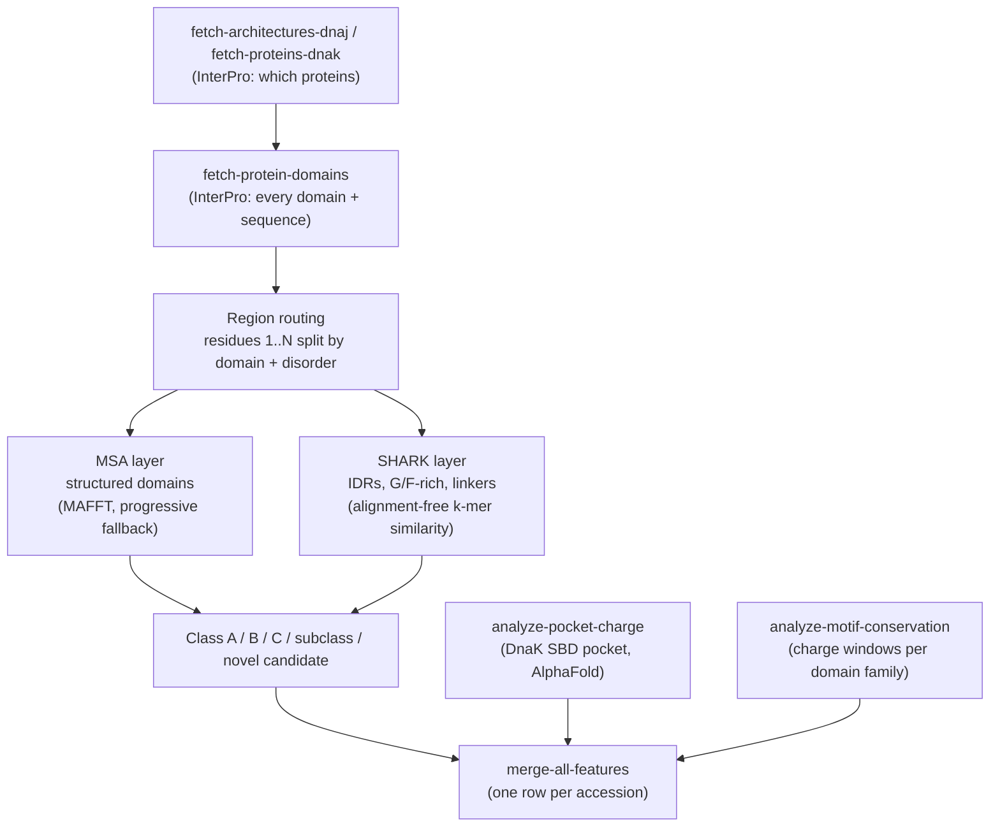
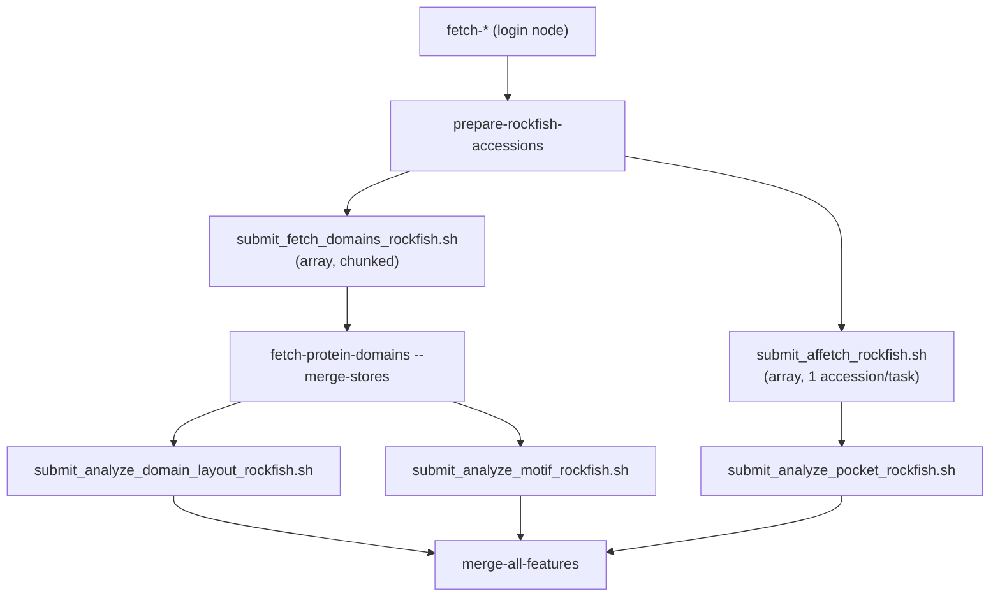

# JHU BioREU JDP Classification Project

The project goal is building a **protein ID system** for J-domain proteins. Instead of saying “this unknown protein kind of looks like something from *E. coli* or humans,” we want a systematic way to look at its parts and predict what job it probably does in the Hsp70 chaperone system ([FEBS review](https://febs.onlinelibrary.wiley.com/doi/10.1111/febs.70359)).

## Core background

Proteins are chains of amino acids that fold into 3D shapes. Those shapes let proteins do cellular jobs: catalyzing reactions, carrying signals, building structures, or binding other molecules.

Sometimes proteins fold incorrectly, partly unfold, or clump together. **Chaperones** are helper proteins that prevent this damage or help proteins recover ([PubMed](https://pubmed.ncbi.nlm.nih.gov/35729039/)).

**Hsp70** is one of the most important chaperones. It works like a reusable clamp: it grabs exposed sticky parts of proteins, uses ATP energy, and releases them so they get another chance to fold correctly ([FEBS review](https://febs.onlinelibrary.wiley.com/doi/10.1111/febs.70359)).

**J-domain proteins (JDPs)**, of which Hsp40 is a famous example, tell Hsp70 where to act. Hsp70 is the powerhouse; JDPs provide much of the targeting logic ([bioRxiv](https://www.biorxiv.org/content/10.1101/2024.10.15.618527v1.full.pdf)). JDPs recognize misfolded, unfolded, or aggregating proteins and recruit **ATP-bound Hsp70**. In the ATP-bound state, Hsp70’s **nucleotide-binding domain (NBD)** and **substrate-binding domain (SBD)** are tightly coupled; contact with the J-domain stimulates ATP hydrolysis so Hsp70 can grip and release client proteins in a controlled cycle ([FEBS review](https://febs.onlinelibrary.wiley.com/doi/10.1111/febs.70359)).

## Acronym guide

| Acronym | Meaning | Simple meaning |
|---------|---------|----------------|
| JDP | J-domain protein | A protein that helps Hsp70 work. |
| JD | J-domain | The small part of a JDP that contacts Hsp70. |
| Hsp70 | Heat shock protein 70 | A major chaperone that helps proteins fold or recover. |
| Hsp40 | Heat shock protein 40 | Older/common name for many JDPs. |
| DnaK | Bacterial Hsp70 | The *E. coli* version of Hsp70. |
| DnaJ | Bacterial JDP/Hsp40 | The classic JDP used as the reference model. |
| ATP | Adenosine triphosphate | The cell’s energy currency. |
| ADP | Adenosine diphosphate | The lower-energy product after ATP is used. |
| NEF | Nucleotide exchange factor | A protein that helps Hsp70 reset for another cycle. |
| HPD | Histidine-proline-aspartate | A key three-amino-acid motif in real J-domains. |
| G/F-rich | Glycine/phenylalanine-rich | A flexible region common in class A and B JDPs. |
| IDR | Intrinsically disordered region | A protein segment with no fixed 3D structure. |
| MSA | Multiple sequence alignment | Aligning homologous sequences column by column. |
| DNAJA | Class A human-style JDP group | DnaJ-like JDPs with many classic domains. |
| DNAJB | Class B human-style JDP group | J-domain plus G/F-rich region but less complete DnaJ-like architecture. |
| DNAJC | Class C human-style JDP group | Very diverse JDPs that do not fit class A or B. |
| ER | Endoplasmic reticulum | A cell compartment where secreted and membrane proteins fold. |
| TM | Transmembrane | A protein segment that crosses a membrane. |
| TPR | Tetratricopeptide repeat | A repeated protein-binding module found in some chaperone-related proteins. |
| DUF | Domain of unknown function | A predicted domain whose job is not yet well understood. |
| HMM | Hidden Markov model | A computational pattern detector used to find protein domains. |
| Pfam / InterPro | Protein domain databases | Tools/databases used to label domains in protein sequences. |

Key references for this section: [FEBS review](https://febs.onlinelibrary.wiley.com/doi/10.1111/febs.70359), [bioRxiv preprint](https://www.biorxiv.org/content/10.1101/2024.10.15.618527v1.full.pdf), [PubMed](https://pubmed.ncbi.nlm.nih.gov/35729039/).

## What a domain is

A **domain** is a reusable part of a protein, think of it like a LEGO block with a specific shape and job.

A protein’s **domain architecture** is which domains it has and in what order. For JDPs this matters because the J-domain activates Hsp70, while other domains often decide which substrates the JDP recognizes, where it localizes, and which pathway it joins ([bioRxiv](https://www.biorxiv.org/content/10.1101/2024.10.15.618527v1.full.pdf)).

This project is not only asking “Does this protein have a J-domain?” It asks **“What kind of JDP is this, based on the full layout of its components?”**

## JDP classes

The simplest classification is **class A**, **class B**, and **class C**, based on similarity to classic bacterial DnaJ ([FEBS review](https://febs.onlinelibrary.wiley.com/doi/10.1111/febs.70359)).

| Class | Simple signature | Simple interpretation |
|-------|------------------|----------------------|
| Class A / DNAJA | N-terminal J-domain, G/F-rich region, client-binding domains, zinc-finger-like region, and dimerization region | Most similar to classic DnaJ; often a general protein-folding helper. |
| Class B / DNAJB | N-terminal J-domain and G/F-rich region but lacks some class A features (especially the zinc-finger-like region) | Similar to class A, but often more specialized. |
| Class C / DNAJC | J-domain present but architecture does not match class A or B | A large mixed category; often specialized for particular pathways. |

Treat “class C” cautiously: it groups many specialized JDPs that are not yet fully subdivided ([FEBS review](https://febs.onlinelibrary.wiley.com/doi/10.1111/febs.70359)).

## Classifier goals

The long-term goal is an **unbiased classifier** — one that does not rely only on classic model organisms (*E. coli*, yeast, humans) but can handle unfamiliar proteins from non-model species ([bioRxiv](https://www.biorxiv.org/content/10.1101/2024.10.15.618527v1.full.pdf)).

For each protein, the classifier should eventually answer:

- Does it have a real J-domain?
- Does the J-domain contain the important HPD motif?
- Where is the J-domain: beginning, middle, or end?
- Does it have a G/F-rich region?
- Does it have client-binding domains?
- Does it have membrane-spanning regions?
- Does it have signal peptides that target a compartment?
- Does it resemble class A, class B, class C, or a more specific subclass?
- Is the classification high-confidence or uncertain?

A useful output goes beyond “class C”. For example: “High-confidence membrane-associated class C JDP with an HPD-containing J-domain and a transmembrane segment, likely recruiting Hsp70 to a membrane-localized process” ([FEBS review](https://febs.onlinelibrary.wiley.com/doi/10.1111/febs.70359)).

JDPs customize where and how Hsp70 acts: newly made proteins, damaged proteins, aggregates, membranes, organelles, ribosomes, or degradation pathways ([PubMed](https://pubmed.ncbi.nlm.nih.gov/35729039/)).

---

## Pipeline overview

Every protein collected from InterPro is taken through the same path: fetch identity, fetch **all** of its domains, cut it into residue regions, send each region to the layer that can actually score it, and combine the evidence into a class call.


```mermaid
flowchart TD
  fetch["fetch-architectures-dnaj / fetch-proteins-dnak<br/>(InterPro: which proteins)"]
  domains["fetch-protein-domains<br/>(InterPro: every domain + sequence)"]
  route["Region routing<br/>residues 1..N split by domain + disorder"]
  msa["MSA layer<br/>structured domains<br/>(MAFFT, progressive fallback)"]
  sharklayer["SHARK layer<br/>IDRs, G/F-rich, linkers<br/>(alignment-free k-mer similarity)"]
  classify["Class A / B / C / subclass / novel candidate"]
  merge["merge-all-features<br/>(one row per accession)"]

  fetch --> domains --> route
  route --> msa --> classify
  route --> sharklayer --> classify
  classify --> merge
  pocket["analyze-pocket-charge<br/>(DnaK SBD pocket, AlphaFold)"] --> merge
  motif["analyze-motif-conservation<br/>(charge windows per domain family)"] --> merge
```

**Why two layers.** Structured domains are alignable, so cross-homolog comparison there is an alignment problem. IDRs, G/F-rich blocks, and linkers are *not* alignable — aligning them produces confident nonsense — so they go to [SHARK](https://git.mpi-cbg.de/tothpetroczylab/shark), which compares sequences by relating k-mers instead of by aligning them. Which residues belong in which bucket is decided per protein by [metapredict](https://github.com/idptools/metapredict) disorder scores plus the InterPro domain boundaries.

**Backends are optional and always reported.** `metapredict` (PyTorch) and `bio-shark` are installed with the `layout` extra. When they are absent the pipeline still runs end to end using documented fallbacks — FoldIndex for disorder, BLOSUM62-normalized k-mer scoring for similarity — and every output row records which backend produced the number (`disorder_backend`, `shark_backend`). A fallback score is never presented as a metapredict or SHARK score.

**Backends are chosen per protein, not per run.** metapredict cannot encode residues
outside the 20 standard amino acids, and real UniProt sequences do contain `X`. Sequences
are screened before the call, so only the affected proteins use FoldIndex — on a 2,000-protein
sample from the live DnaJ set, 10 sequences contained `X` and exactly those 10 fell back,
leaving 1,990 on metapredict. Batching without that screen let a single unusual sequence
downgrade its entire batch (1,250 of 2,000 proteins) while the run still reported
"metapredict". Run summaries now list every backend used, with per-backend counts.

**The class call does not depend on which backend ran.** The predictor decides where region boundaries fall, not the biology. Class and subclass calls are verified identical across metapredict V3 vs FoldIndex *and* SHARK vs the k-mer fallback, on all seven reference JDPs (`tests/test_reference_jdps.py`; each check activates when its package is installed). Numeric columns such as `idr_fraction` and `shark_best_similarity` do legitimately differ between backends, which is why the backend is recorded alongside them.

Score scales differ, so read similarity against the backend that produced it:

| Region pair | `bio_shark` | `blosum_kmer` |
|-------------|-------------|---------------|
| Identical | 0.86 | 1.00 |
| Near-identical | 0.85 | 0.97 |
| Unrelated composition | 0.10 | 0.00 |

Both separate related from unrelated regions well clear of the 0.35 novelty threshold.

## Requirements

- Python **3.12+** (the `layout` extra needs 3.12 specifically: `bio-shark` supports `>=3.8,<3.13`)
- Network access to `www.ebi.ac.uk` (InterPro) and `rest.uniprot.org` (UniProt fallbacks)

## Installation

Clone the repository and install in **editable** mode so console commands are registered and local changes take effect immediately.

```bash
pip install -e ".[dev,structure,layout]"
```

| Extra | Adds | Needed for |
|-------|------|-----------|
| `dev` | pytest, pytest-asyncio | Test suite |
| `structure` | numpy, scipy, pyyaml | Pocket-charge analysis |
| `layout` | metapredict, bio-shark | Real disorder + SHARK backends (optional) |

Conda:

```bash
conda env create -f environment.yaml
conda activate reu_project
pip install -e .
```

## Commands

| Command | What it does |
|---------|--------------|
| `fetch-proteins-dnak` | All proteins for InterPro IPR012725 (DnaK) |
| `fetch-architectures-dnaj` | Proteins for the top *N* domain architectures of IPR001623 (DnaJ) |
| `fetch-protein-domains` | **Every InterPro/member-database domain plus the sequence** for each accession |
| `analyze-domain-layout` | Region routing + metapredict/SHARK dual layer + class/subclass/novel call |
| `classify-jdp` | Rule-based class A/B/C from domain architecture, HPD, and localization |
| `analyze-motif-conservation` | Conserved charge windows and IDR block grammars per domain family |
| `analyze-pocket-charge` | Net charge at the DnaK/Hsp70 SBD peptide-binding pocket |
| `validate-jdp-classification` | Quality control, calibration against curated labels, permutation nulls, cross-species recurrence |
| `extract-uniprot-ids` | Unique accessions to stdout or a file |
| `prepare-rockfish-accessions` | Deduped accession queue for SLURM array jobs |
| `summarize-rockfish-failures` | Reason-code summary of a failure log |
| `merge-features` | Fetch JSON + pocket CSV |
| `merge-all-features` | Fetch JSON + pocket + JDP + motif + domain layout |

Every command supports `--help`. Without installing, run modules directly: `python -m data_fetching.fetch_domains --help`.

---

## 1. Fetch proteins from InterPro

### `fetch-proteins-dnak` (IPR012725 / DnaK)

```bash
fetch-proteins-dnak -o ipr012725_proteins.json
```

| Flag | Description | Default |
|------|-------------|---------|
| `-p`, `--page-size` | Results per API page | `200` |
| `-o`, `--output` | Output JSON file path | `ipr012725_proteins.json` |
| `-k`, `--checkpoint` | Checkpoint file for resume | `ipr012725_checkpoint.json` |
| `-m`, `--max-percent` | Percent threshold for soft count notification | `0.01` |
| `-a`, `--max-abs` | Absolute threshold for hard count warning | `100` |
| `-t`, `--timeout` | Request timeout in seconds | `300` |

**Checkpoint / resume:** if pagination is interrupted, progress is saved to the checkpoint file; re-run the same command to resume. The checkpoint is deleted on success.

### `fetch-architectures-dnaj` (IPR001623 / DnaJ)

```bash
fetch-architectures-dnaj -n 20 -o ipr001623_domain_architectures_no_dedup.json
```

| Flag | Description | Default |
|------|-------------|---------|
| `-n`, `--n-architectures` | Number of architectures to fetch | `20` |
| `-u`, `--arch-url` | Custom architecture list API URL | InterPro IPR001623 endpoint |
| `-c`, `--concurrency` | Max concurrent architecture fetches | `5` |
| `-o`, `--output` | Output JSON file path | `ipr001623_domain_architectures_no_dedup.json` |

Proteins appearing in several architectures are stored several times and flagged with `appears_in_architecture_count`. The run warns if InterPro no longer returns the recorded first architecture (`ida_id` or protein count drift), because that silently changes what `-n` selects.

### Output format

DnaK:

```json
{
  "entry_accession": "IPR012725",
  "proteins_reported": 100000,
  "total_proteins_fetched": 100000,
  "is_partial": false,
  "proteins": []
}
```

DnaJ:

```json
{
  "architectures": [
    {
      "ida": "PF00226:IPR001623",
      "ida_id": "500088c3adc88e8af670fe08554083396acf46f3",
      "unique_proteins_reported": 98256,
      "proteins_fetched": 99077,
      "is_partial": false,
      "proteins": [{"appears_in_architecture_count": 2}]
    }
  ],
  "total_proteins_fetched": 225610
}
```

**Important:** these records carry *metadata only* — no sequence and no per-protein domain coordinates. That is what the next step adds.

## 2. Fetch every domain (`fetch-protein-domains`)

For each accession this queries `entry/all/protein/uniprot/<accession>` (every InterPro and member-database signature with residue coordinates) and `protein/uniprot/<accession>` (sequence, length, organism), and writes a **domain store**.

```bash
# From a fetch JSON
fetch-protein-domains --from-fetch-json ipr001623_domain_architectures_no_dedup.json -o protein_domains.json

# From an accession list (e.g. the Rockfish queue file)
fetch-protein-domains --accessions-file "${WK_DIR}/incomplete_accessions.txt" -o protein_domains.json

# Ad hoc
fetch-protein-domains P08622 P31689 -o protein_domains.json
```

| Flag | Description | Default |
|------|-------------|---------|
| `--from-fetch-json` | Take accessions from a DnaK/DnaJ fetch JSON | — |
| `--accessions-file` | Take accessions from a text file (one per line) | — |
| `-o`, `--output` | Domain store output path | `protein_domains.json` |
| `-c`, `--concurrency` | Max concurrent accession fetches | `5` |
| `--start` / `--count` | 1-based slice of the accession list (SLURM chunking) | `1` / all |
| `--checkpoint` | Checkpoint store for resume | `<output>.checkpoint.json` |
| `--checkpoint-every` | Write the checkpoint every N accessions | `200` |
| `--rate-limit` | Max InterPro requests per second (0 disables pacing) | `10` |
| `--no-sequence` | Fetch domains only (skips the sequence request) | off |
| `--refresh` | Ignore existing output/checkpoint and re-fetch | off |
| `--merge-stores` | Merge every `*.json` store in a directory into `--output` | — |
| `--quiet` | Disable the progress bar | off |

**Resume is automatic:** accessions already present in `--output` (or in the checkpoint) are skipped, so re-running after an interruption only fetches what is missing. A record stored *without* a sequence (from `--no-sequence`) is re-fetched when a later run wants sequences, so a domains-only store is never a dead end. Per-accession failures are recorded with a reason (`not_found`, `retries_exhausted`, `http_error_<status>`) instead of aborting the run.

**Request pacing:** a full DnaJ fetch is hundreds of thousands of requests and several SLURM array tasks run at once, so each process paces itself to `--rate-limit` requests per second (default 10) rather than releasing bursts. Raise it only if EBI confirms a higher rate is welcome.

**Two requests per protein is the API's shape, not a design choice.** The entry endpoint
rejects `extra_fields=sequence` (it only exposes entry-level fields), and the
protein-centric view returns an `entries_url` rather than inline matches, so domains and
sequence cannot be had in one call.

**The fetch is API-latency-bound, so more concurrency does not mean more throughput.**
Measured on the live DnaJ run: 6 concurrent tasks completed a 400-accession chunk in ~8
minutes; doubling to 12 pushed each chunk to ~16 minutes for the *same* ~45 chunks/hour.
Extra connections simply cost EBI twice the load, so keep `ARRAY_CONCURRENCY` low and
expect roughly 45 chunks (18k proteins) per hour.

Domain store format:

```json
{
  "store_version": 1,
  "source": "ipr001623_domain_architectures_no_dedup.json",
  "n_proteins": 2,
  "n_failed": 0,
  "n_with_sequence": 2,
  "proteins": {
    "P08622": {
      "accession": "P08622",
      "name": "Chaperone protein DnaJ",
      "length": 376,
      "sequence": "MAKQDYYEILGV...",
      "organism_name": "Escherichia coli",
      "entries": [
        {
          "accession": "PF00226",
          "source_database": "pfam",
          "entry_type": "domain",
          "integrated": "IPR001623",
          "fragments": [{"start": 5, "end": 67}]
        }
      ]
    }
  },
  "failures": {}
}
```

## 3. Domain layout: the dual layer (`analyze-domain-layout`)

```bash
analyze-domain-layout protein_domains.json -o domain_layout_results
```

| Flag | Description | Default |
|------|-------------|---------|
| `--disorder-backend` | `auto` \| `metapredict` \| `foldindex` | `auto` |
| `--shark-backend` | `auto` \| `bio_shark` \| `blosum_kmer` | `auto` |
| `--reference-store` / `--reference-classes` | Curated reference JDPs for SHARK comparison | bundled `data/reference_jdps/` |
| `--no-references` | Skip the SHARK reference comparison | off |
| `--no-fasta` | Do not write subFASTA files | off |
| `--workers` | Analyze proteins across N processes (results unchanged) | `1` |
| `--max-proteins` | Analyze only the first N proteins (smoke test) | all |
| `--show-backends` | Print which backends are active and exit | — |

### Scale

The full DnaJ set is ~225k proteins, so the alignment-free layer is the cost centre: every
unalignable region is scored against every reference region at three k-mer lengths.

| Configuration | Per protein | 225k proteins |
|---------------|-------------|---------------|
| Naive per-pair scoring | 2251 ms | ~141 h |
| Vectorized k-mer scoring | 19 ms | ~1.2 h |
| Vectorized + `--workers 4` | 7 ms | ~0.4 h |

The speedup is arithmetic, not statistical: k-mers are encoded once per sequence (cached
across proteins, since every reference is re-scored against every query) and whole
k-mer blocks are scored with matrix gathers instead of per-residue dictionary lookups.
Scores are identical to the naive implementation to within floating-point noise
(verified to 3e-16 across 720 randomized comparisons), and `--workers` only changes wall
time — output and row order are unchanged. Very long region pairs are scored in blocks so
a single comparison cannot allocate an unbounded matrix.

The Rockfish job defaults `--workers` to the cores SLURM granted it.

Workers use the `spawn` start method rather than the Linux default `fork`: metapredict
imports PyTorch, which starts threads, and forking a multi-threaded process can deadlock
the child — on a cluster that looks like a job hanging until its time limit. Spawn costs a
little startup time per worker and removes the failure mode. As with any `spawn`-based
multiprocessing, call the pipeline from an importable entry point (the console script,
`python -m domain_layout.cli`, or a module guarded by `if __name__ == "__main__":`), not
from a script piped in on stdin.

### How residues are routed

1. **Structured blocks** come from the InterPro domain matches. Overlapping signatures are resolved by family knowledge, then member-database reliability (Pfam → InterPro → CDD → …), then length; whole-protein family spans (≥90% coverage) are ignored because they are not domain boundaries. Discontinuous domains keep their fragments, so the zinc finger inserted into DnaJ's C-terminal domain produces separate blocks.
2. **Everything else** is split by the disorder prediction into IDR and non-IDR pieces; pieces shorter than 8 residues are absorbed into their neighbour. Non-IDR pieces are `terminus` (touching residue 1 or N) or `linker`.
3. **Routing:** alignable domain families → `msa`; G/F-rich domains, IDRs, linkers, and termini → `shark`; anything below the minimum scoring length → `skip`. Every residue lands in exactly one region.

Example (*E. coli* DnaJ, P08622):

| Region | Residues | Kind | Family | Route |
|--------|----------|------|--------|-------|
| 2 | 5–67 | structured_domain | j_domain | msa |
| 4 | 77–116 | linker (G/F-rich) | — | shark |
| 5 | 117–143 | structured_domain | dnaj_c | msa |
| 6 | 144–204 | structured_domain | zinc_finger_like | msa |
| 7 | 205–330 | structured_domain | dnaj_c | msa |
| 9 | 336–373 | structured_domain | dnaj_c | msa |

### The MSA layer (MAFFT)

Structured domains are alignable, so they go to a real multiple-sequence alignment rather
than the alignment-free comparison used for the disordered half. [MAFFT](https://mafft.cbrc.jp/alignment/software/)
is the aligner of record. It is a compiled binary rather than a Python package, so it is
invoked as a subprocess by `domain_layout/msa.py`, which sits alongside the disorder and
SHARK adapters and follows the same backend-reporting contract.

The invocation is:

```
mafft --auto --anysymbol --quiet --thread <n> <input.fasta>
```

Each flag is load-bearing:

- `--auto` selects the algorithm from the input size, so one command is correct for a
  six-member family and a five-thousand-member one.
- `--anysymbol` is required, not cosmetic. These sequences genuinely contain X, U, B and
  Z; without it MAFFT rejects or rewrites them. (The same class of residue silently
  degraded the SHARK layer before it was screened - see the note in `domain_layout/shark.py`.)
- `--quiet` keeps MAFFT's progress report off stderr, where it would otherwise dominate a
  cluster log.
- `--thread` is pinned (default 1) so a rerun is byte-identical without having to reason
  about which algorithm `--auto` picked on a given machine.
- `--reorder` is deliberately **absent**. Rows are mapped back to accessions by position,
  and a reordering would misattribute every residue. Sequences are written under
  synthetic IDs (`s0`, `s1`, …) and re-keyed by those IDs on the way out, so a silent
  reordering is caught rather than assumed away.

MAFFT lower-cases residues in several modes, so output is upper-cased before it reaches
the charge and composition tables, which are case-sensitive.

**Fallback.** Without the binary on `PATH`, alignment falls back to a progressive
alignment against a running consensus (Biopython pairwise). That is genuinely weaker - no
guide tree, no refinement, order-dependent - so the backend is recorded on every
alignment and written to `msa_backend` in `motif_family_summary.csv`. A fallback
alignment is never reported as a MAFFT alignment. On Rockfish, `ml mafft/7.525`; locally,
`conda install -c conda-forge mafft` (it is in `environment.yaml`).

**Aligning in place.** `analyze-domain-layout --align-msa` aligns each MSA-routed
subFASTA and writes the result to `subfastas/msa_aligned/<family>.aln.fasta`, with a
per-family record (available, aligned, columns, backend) in the run summary. Without it
the subFASTAs are only ever *input* to something else. It is off by default because on a
proteome-scale run it is a second substantial compute stage.

`--max-aligned-per-family` (default 2000) caps each family. This is not optional at scale:
a full-proteome run puts well over a hundred thousand J-domains in one family, which no
aligner will handle in reasonable time or memory. Past the cap a seeded random sample is
aligned and `n_available` records what the family actually held.

**Family sampling.** `--max-per-family` now takes a seeded random sample rather than the
first *N* members. The difference matters: slices arrive in accession order and UniProt
accessions cluster by submitting project and organism, so the first 500 members of a
family come from a handful of proteomes, and a conservation score measured on them
describes those proteomes rather than the family. `n_available` in the summary CSV records
how many members existed before sampling.

### Outputs

| File | Contents |
|------|----------|
| `domain_layout_regions.csv` | One row per region: coordinates, kind, family, route, disorder, net charge, sequence |
| `domain_layout_features.csv` | One row per protein: evidence flags, backends, class/subclass/novelty |
| `domain_layout_summary.json` | Run-level counts (classes, subclasses, routed residues, backends) |
| `subfastas/by_class/class_<X>.fasta` | Full-length sequences grouped by predicted class |
| `subfastas/msa/<family>.fasta` | Structured regions per family — **MAFFT input** (see [the MSA layer](#the-msa-layer-mafft)) |
| `subfastas/msa_aligned/<family>.aln.fasta` | MAFFT alignments of the above (`--align-msa`) |
| `subfastas/shark/<kind>.fasta`, `subfastas/shark/class_<X>_<kind>.fasta` | Unalignable regions — **SHARK input** |

Key feature columns:

| Column | Meaning |
|--------|---------|
| `domain_family_layout` | Ordered structured families, e.g. `j_domain>dnaj_c>zinc_finger_like>dnaj_c` |
| `idr_fraction` | Fraction of residues in IDR regions **after** annotated domains are carved out |
| `disorder_backend` / `shark_backend` | Which backend produced the numbers in this row |
| `n_msa_regions` / `n_shark_regions` | How many regions went to each layer |
| `shark_best_reference`, `shark_best_reference_class`, `shark_best_similarity` | Closest curated reference region |
| `layout_predicted_class` | `A` / `B` / `C` / `unknown` |
| `layout_predicted_subclass` | Structural call: `a_canonical`, `a_zinc_finger_no_ctd`, `b_canonical`, `b_gf_rich_no_ctd`, `c_j_domain_only`, `c_membrane_associated`, `c_secretory_signal`, `c_atypical_multi_domain`, `c_unassigned`. Independent of novelty, which has its own columns |
| `layout_novelty_score` | 0–1; how poorly the protein matches the reference templates |
| `novel_class_candidate` | `true` when `layout_novelty_score ≥ 0.5` and a J-domain is present |
| `layout_evidence_tags` | Which novelty terms fired, plus `membrane_associated`, `idr_dominated`, … |

### Class rules and the novel category

Class assignment uses the **full domain complement**, not a single architecture string. The zinc-finger-like cysteine-rich region is the class A/B discriminator:

- **A** — J-domain + zinc-finger-like region (`a_canonical` when the C-terminal domain is also present)
- **B** — J-domain + C-terminal substrate-binding domain and/or a G/F-rich region, no zinc finger
- **C** — J-domain present, neither A nor B; subdivided by TM/signal evidence and domain layout
- **unknown** — no J-domain found

The **novelty score** sums four independent failures to match the reference templates (weights sum to 1.0):

| Term | Weight | Fires when |
|------|--------|-----------|
| `no_hpd_in_j_domain` | 0.25 | No HPD motif inside the J-domain region |
| `j_domain_internal` / `j_domain_c_terminal` | 0.15 | J-domain is not N-terminal |
| `no_canonical_partner_domain` | 0.20 | No C-terminal domain, zinc finger, or G/F-rich region |
| `unannotated_partner_domain` | 0.15 | Partner domains exist but none is a known JDP module |
| `shark_dissimilar_to_reference_classes` | 0.25 | Best SHARK similarity to any reference region < 0.35 |

A protein is a **novel-category candidate** at ≥ 0.5 — i.e. its J-domain context, its partner domains, *and* its unalignable regions all fail to look like class A, B, or the usual C. This is a screening flag for follow-up, not a new named class.

### Curated reference JDPs

`data/reference_jdps/` holds a small domain store (fetched with `fetch-protein-domains`) plus a hand-curated class map: P08622 and P31689 (A), P25685, P25686, P36659 (B), Q9H3Z4 and Q9NVH1 (C). Their unalignable regions are the SHARK comparison targets. `tests/test_reference_jdps.py` asserts the pipeline reproduces all seven curated classes, so a change to the router or rules that reassigns them fails the suite.

## 4. JDP classifier (`classify-jdp`)

Rule-based class A/B/C from the architecture, with HPD detection, TM/signal localization, and layout tags.

```bash
classify-jdp ipr001623_domain_architectures_no_dedup.json \
  --domain-json protein_domains.json \
  -o data/jdp_classifications/jdp_classifications.csv
```

| Flag | Purpose |
|------|---------|
| `--domain-json` | Domain store; supplies sequences and domains so no UniProt requests are needed |
| `--dnaj-rows dedupe` | One row per accession (default); uses the longest architecture |
| `--dnaj-rows explode` | One row per (accession, architecture) |
| `--min-confidence` | Filter rows by `class_confidence` |
| `--no-fetch` | Skip the UniProt FASTA and features fallbacks |

With `--domain-json` the classifier prefers whichever architecture names more domains — the fetch group IDA or the one rebuilt from the protein's own Pfam matches — and records which in `architecture_source` (`fetch` or `domain_store`).

| Column | Meaning |
|--------|---------|
| `predicted_class` | `A`, `B`, `C`, or `unknown` |
| `class_confidence` | `high` / `medium` / `low` |
| `architecture_source` | Where the architecture used for the call came from |
| `has_gf_rich` | G/F-rich Pfam (`PF09320`) in the architecture |
| `has_transmembrane`, `has_signal_peptide`, `localization_source` | TM/signal evidence from InterPro entries, else UniProt features |
| `has_hpd`, `hpd_source`, `hpd_confidence` | HPD motif in the J-domain slice |
| `j_domain_position` | `n_terminal`, `internal`, `c_terminal`, `unknown` |
| `layout_tags` | `j_domain_only`, `membrane_associated`, `secretory_signal`, `atypical_multi_domain`, `gf_rich_atypical` |
| `quality_flags` | `no_hpd`, `sequence_from_uniprot`, `no_sequence`, `multi_architecture`, `no_j_domain_in_ida` |

Sanity check: *E. coli* DnaJ (`P08622`) classifies as **A** with HPD and no TM/signal tags. See [`docs/jdp_classifier_calibration.md`](docs/jdp_classifier_calibration.md).

**Limitations:** class C is still broad beyond its subclasses; TM/signal rely on curated InterPro IDs and UniProt annotations, not TMHMM/Phobius.

## 5. DnaJ conserved charge / motif windows (`analyze-motif-conservation`)

Aligns DnaJ domain families with [MAFFT](#the-msa-layer-mafft), sweeps sliding-window charge conservation across homologs, and segments IDR/G/F-like regions into compositional block grammars. Window length is chosen by cross-homolog conservation, not by DnaK charge-inversion labels (those stay a held-out sanity check).

Use `--msa-backend` to force `mafft` or the `progressive` fallback, `--msa-threads` for MAFFT's thread count, and `--seed` to fix the per-family sub-sample when `--max-per-family` is set. The aligner actually used is written to `msa_backend` in the summary CSV, so a fallback run is never mistaken for a MAFFT one.

```bash
analyze-motif-conservation ipr001623_domain_architectures_no_dedup.json \
  --domain-json protein_domains.json \
  -o motif_results
```

`--domain-json` is required in practice: the architecture fetch has no sequences or domain coordinates to slice, so without it the run produces zero rows (and now says so). Passing both restricts the analysis to the fetch's accessions; passing only `--domain-json` analyzes the whole store.

Optional held-out overlap with pocket charge-inversion candidates:

```bash
analyze-motif-conservation ... --held-out-pocket-csv pocket_results/pocket_charge_summary.csv
```

Outputs: `motif_family_summary.csv`, `motif_accession_features.csv`, `motif_conservation_curves.json`, `motif_run_metadata.json`.

## 6. Binding-pocket charge analysis (v4, `analyze-pocket-charge`)

Measures net charge at the **DnaK/Hsp70 SBD peptide-binding pocket** on AlphaFold models. The pocket is defined from PDB [1DKX](https://www.rcsb.org/structure/1DKX) (peptide-contact residues within 8 Å) and transferred to each homolog by SBD-domain alignment, testing whether some DnaK homologs show electrostatic differences (“charge inversion”) relative to *E. coli* DnaK (`P0A6Y8`).

v4 adds: two-axis confidence (`mapping_confidence` separate from `conservation_score`), Kabsch SBD superposition with rotation-invariant `contact_drmsd`, a smart fallback when AlphaFold models cannot be superposed, and the `charge_inversion_candidate` flag (mapping high + conservation low + |contact Δ| ≥ 2).

```bash
pip install -e ".[structure]"

# Single structure
analyze-pocket-charge data/dev_structures/AF-P0A6Y8-F1-model_v6.pdb \
  --reference-pocket data/pocket_refs/dnak_sbd_pocket.yaml -o pocket_charge_P0A6Y8.json

# Batch, sensitivity sweep, and per-residue exports
analyze-pocket-charge data/dev_structures --batch --output-dir data/pocket_charge_results
analyze-pocket-charge data/dev_structures --sensitivity --output-dir data/pocket_charge_results
analyze-pocket-charge data/dev_structures/AF-P08113-F1-model_v6.pdb \
  --export-pocket-residues pocket_residues_P08113.csv \
  --export-contact-attribution contact_attribution_P08113.csv

# Merge per-accession JSON (e.g. after a Rockfish array)
analyze-pocket-charge --merge-results data/pocket_charge_results \
  --output-dir data/pocket_charge_results --min-mapping-confidence high
```

Dev structures (gitignored, download into `data/dev_structures/`): `P0A6Y8` (*E. coli* DnaK reference), `P11142` (human HSPA8), `P08113` (yeast HSP70), `P61889` (*T. thermophilus*), `P42943` (plant).

```bash
curl -o data/dev_structures/AF-P0A6Y8-F1-model_v6.pdb \
  https://alphafold.ebi.ac.uk/files/AF-P0A6Y8-F1-model_v6.pdb
```

| Field | Meaning |
|-------|---------|
| `contact_net_charge` | Net charge (Lys/Arg/His − Asp/Glu) at the 17 mapped contact residues |
| `shell_net_charge` | Net charge across contact + SBD-masked 8 Å shell |
| `delta_contact_net_charge` / `delta_net_charge_vs_reference` | Contact / shell charge minus the reference |
| `mapping_confidence` | Structural/SBD placement tier |
| `conservation_score` | Contact sequence similarity tier (independent of mapping) |
| `confidence_tier` | Conservative combined tier: min(mapping, conservation) |
| `contact_drmsd` | Rotation-invariant pocket geometry RMSE |
| `quality_flags` | `charge_inversion_candidate`, `unreliable_superposition`, `divergent_contact_sequences`, … |

For charge-inversion screening filter on `--min-mapping-confidence high` (not the conservative combined tier): divergent homologs can have high mapping with low conservation.

Dev-set validation (v4):

| Accession | Mapping | Conservation | contact Δ | shell Δ | DRMSD | Interpretation |
|-----------|---------|--------------|-----------|---------|-------|----------------|
| P0A6Y8 | high | high | 0 | 0 | 0.0 | Reference |
| P08113 | high | low | **+2** | **+5** | 8.7 | Charge-inversion candidate |
| P11142 | high | medium | 0 | 0 | 1.4 | Neutral vs reference |
| P42943 | medium | low | +1 | −2 | — | Partial mapping (76%) |
| P61889 | low | low | +5 | +5 | 8.3 | Do not trust |

Details: [`docs/pocket_validation.md`](docs/pocket_validation.md). Pocket definition: [`data/pocket_refs/dnak_sbd_pocket.yaml`](data/pocket_refs/dnak_sbd_pocket.yaml).

## 7. Validation (`validate-jdp-classification`)

The novelty flag is a weighted sum of hand-chosen terms. On its own, "5.7% of proteins
are novel-category candidates" is not a result: the same rules applied to data with the
biology removed would also produce a number, and until that number is known the first one
means nothing. This stage supplies the missing controls.

```bash
validate-jdp-classification protein_domains.json \
  -o validation_report.json --permutations 200 --recurrence-permutations 1000 --workers 12
```

### Quality control (fragment filter)

Incomplete sequences are the obvious false-positive source: a truncated entry has no
C-terminal domain and no G/F-rich region because the residues are missing, not because
the protein lacks them, and it scores as novel for entirely artefactual reasons. Records
are excluded for any of:

| Reason | Rule |
|--------|------|
| `uniprot_fragment` | UniProt's own `is_fragment` flag |
| `below_minimum_length` | Shorter than 100 residues - below a J-domain plus any context |
| `single_domain_covers_entry` | One **domain**-type signature spans >= 95% of the sequence, so nothing outside it was ever observable |
| `no_sequence` | No sequence to analyse |

On the full 181,526-protein set the filter excludes 14,970 records (8.2%): 13,092
UniProt-flagged fragments, 2,747 below the length floor, and 617 domain excerpts. Of the
fragments, **12,220 carry no other exclusion reason** - they are full-looking entries that
only UniProt knows are incomplete. That is 6.7% of the whole dataset invisible to length
and coverage heuristics, and it is why `--backfill-metadata` is worth the extra fetch.

Only `domain`-type signatures count towards the coverage rule. Family and
homologous-superfamily entries (NCBIfam, HAMAP, PANTHER, InterPro family, CATH-Gene3D)
are *designed* to span a whole protein, and including them excluded textbook full-length
class A JDPs - J-domain plus zinc finger plus C-terminal domain - as though they were
truncated. On a 60-protein pilot that one distinction was the difference between 20
exclusions and 2.

Every downstream statistic is computed on the surviving set, and the report states how
many records were dropped under each reason so the filter can be audited rather than
trusted. Calibration is scored on the filtered set, with the unfiltered figure reported
next to it so the filter cannot be accused of selecting the flattering examples.

`fetch-protein-domains --backfill-metadata -o store.json` refreshes the fragment flag on a
store fetched before it was recorded, using one protein-endpoint request per accession and
leaving the (far more expensive) domain matches untouched.

### Calibration against curated labels

UniProt review status is the only class label here that does not come from this pipeline.
Reviewed entries named `DnaJ homolog subfamily A/B/C member N` give a gold set that is
independent of the rules being tested. Against it the report gives accuracy with a Wilson
95% interval, per-class precision/recall/F1, macro-F1, the full confusion matrix, and -
importantly - the same figures for a majority-class baseline. A classifier that cannot
beat "always predict C" has learned nothing, and reporting accuracy without that
comparison would hide it. Macro-F1 is reported alongside accuracy for the same reason:
the class distribution is uneven enough that accuracy alone flatters the majority class.

### Permutation null for the novelty call

Choosing a null that *can* fail took two attempts, and the discarded one is instructive.
Shuffling whole architectures between proteins is worthless: the candidate count is a
function of the multiset of architectures, which that shuffle preserves exactly, so the
null reproduces the observed count no matter how much real signal exists. It is kept in
the codebase (`permute_architecture_evidence`) with a test asserting it detects nothing,
because a test that cannot fail is not evidence.

The default null is a configuration model over the protein-to-partner-domain bipartite
graph: every protein keeps the number of partner domains it has, every domain family
keeps its total frequency, and only the pairing is randomised. Sequence-derived evidence
(HPD, G/F composition, J-domain placement) belongs to the protein and is never shuffled.
The report gives the observed count against the null distribution, an enrichment ratio, a
one-sided p-value with the +1 correction, and an empirical FDR - the share of the calls
the null alone accounts for. A candidate-set with an empirical FDR near 1.0 is a
descriptive filter, not a discovery, and the report says so in those words.

One caveat is stated in the report rather than buried: when nearly every protein carries a
single partner domain, the candidate rate is fixed by the marginal frequencies and *no*
permutation scheme over pairings can show enrichment. In that regime the recurrence test
below carries the statistical weight.

Because the 0.5 threshold is a judgement call, the report also sweeps it (0.35 / 0.5 /
0.65 / 0.8) so the reader can see how sensitive the candidate set is to that one number.

### Cross-species recurrence

A single protein with an odd architecture is unremarkable - annotation error, incomplete
gene model, or a genuine one-off. The same architecture appearing independently across
distant genera is much harder to explain that way. Spread alone is still not enough, since
common architectures appear in many taxa simply by being common, so each architecture's
genus count is compared against a permutation null that breaks the architecture-organism
association while holding both marginal distributions fixed. Genus is taken as the first
token of the organism name already stored with each record.

One test is run per architecture, so raw p-values would produce false positives in
proportion to the number of architectures examined; the reported significance uses
Benjamini-Hochberg adjusted p-values at FDR 0.05. Architectures seen in fewer than three
proteins are not tested at all, because their null distribution is too coarse for the
p-value to mean anything.

All permutation tests are seeded and the seed is written into the report, so a rerun
reproduces the p-values exactly.

## 8. Merge everything (`merge-all-features`)

```bash
merge-all-features \
  --dnak-json ipr012725_proteins.json \
  --dnaj-json ipr001623_domain_architectures_no_dedup.json \
  --pocket-csv data/pocket_charge_results/pocket_charge_summary.csv \
  --jdp-csv data/jdp_classifications/jdp_classifications.csv \
  --motif-csv motif_results/motif_accession_features.csv \
  --domain-csv domain_layout_results/domain_layout_features.csv \
  -o data/merged_features/all_features.csv
```

Any subset of inputs works; at least one is required. `--join outer` (default) unions accessions, `--join inner` keeps only rows present in **every** provided input.

| Column group | Prefix | Source |
|--------------|--------|--------|
| Identity | — | DnaK fetch → DnaJ fetch → JDP CSV, in that order |
| DnaJ architecture | `dnaj_` | `--dnaj-json` |
| Pocket charge | — (`pocket_quality_flags`) | `--pocket-csv` |
| JDP classifier | `jdp_` | `--jdp-csv` |
| Motif conservation | `motif_` | `--motif-csv` |
| Domain layout | `domain_` | `--domain-csv` |

Derived columns: `has_pocket_charge`, `has_jdp_classification`, `has_motif_features`, `has_domain_layout`, `charge_inversion_candidate`, `novel_class_candidate`, `chaperone_system_membership` (`dnak` / `dnaj` / `dual`), `unified_confidence_tier`, and `classification_tags` (e.g. `dual_chaperone_homolog;jdp_class_a;layout_a_canonical;pocket_charge_inversion`).

`merge-features` remains the simpler DnaK/DnaJ + pocket join:

```bash
merge-features ipr012725_proteins.json \
  --pocket-csv data/pocket_charge_results/pocket_charge_summary.csv \
  -o data/merged_features/dnak_with_pocket.csv
```

---

## Rockfish (SLURM) pipeline

Run these on a Rockfish login node after cloning the repo. **Always submit through the `submit_*_rockfish.sh` launchers** — the worker scripts require a submit-time snapshot and will refuse to run without one.


```mermaid
flowchart TD
  fetch["fetch-* (login node)"] --> prepare["prepare-rockfish-accessions"]
  prepare --> domains["submit_fetch_domains_rockfish.sh<br/>(array, chunked)"]
  prepare --> affetch["submit_affetch_rockfish.sh<br/>(array, 1 accession/task)"]
  domains --> mergestores["fetch-protein-domains --merge-stores"]
  mergestores --> layout["submit_analyze_domain_layout_rockfish.sh"]
  mergestores --> motif["submit_analyze_motif_rockfish.sh"]
  affetch --> pocket["submit_analyze_pocket_rockfish.sh"]
  layout --> mergeall["merge-all-features"]
  motif --> mergeall
  pocket --> mergeall
```

### Cluster conventions

- **Login nodes are for editing and submitting only.** Run work through `sbatch`, or
  `srun` for a short interactive check. `srun` dies with your SSH session, so anything
  long belongs in `sbatch`.
- **The login node's default `python` is too old to parse this project.** The launchers
  therefore run queue helpers with `${CONDA_ENV}/bin/python` (override with `PYTHON=`)
  and fail fast with guidance if that interpreter cannot import the package.
- **Either a conda env or a plain venv works.** `rockfish_activate_env` detects a venv by
  its `pyvenv.cfg` and sources it; anything else is handed to `conda activate`. A venv
  built on an existing Python 3.12 is the quickest route to the `layout` extra, since
  `bio-shark` requires `<3.13`.
- **Never run more workers than CPUs allocated.** The layout job defaults `--workers` to
  `SLURM_CPUS_PER_TASK` and clamps any larger value, because oversubscribing a shared
  node steals CPU from other users and SLURM will not stop you.
- **Watch the group's file-count quota**, not just bytes. Outputs are a handful of files
  per chunk rather than one per protein for exactly this reason.

### 0. One-time setup

```bash
export WK_DIR="${HOME}/scr4_sfried3/alphafoldfetch"
export PROJECT_DIR="${HOME}/repositories/20260601_reu_project"
cd "${PROJECT_DIR}"

conda env create -f scripts/slurm/conda_env.yaml -p "${HOME}/affetch"          # AlphaFoldFetch

conda env create -f scripts/slurm/conda_env_pocket.yaml -p "${HOME}/pocket"    # pocket + motif + domains
conda activate "${HOME}/pocket" && pip install -e ".[structure]"

conda env create -f scripts/slurm/conda_env_layout.yaml -p "${HOME}/layout"    # dual-layer backends
conda activate "${HOME}/layout" && pip install -e ".[structure,layout]"
```

If `metapredict` or `bio-shark` fail to install (PyTorch wheels, CUDA mismatch), the layout job still runs — submit it with `DISORDER_BACKEND=foldindex SHARK_BACKEND=blosum_kmer`.

### 1. Prepare the accession queue (after every fetch)

```bash
prepare-rockfish-accessions ipr001623_domain_architectures_no_dedup.json --wk-dir "${WK_DIR}"

# Pre-flight
wc -l "${WK_DIR}/incomplete_accessions.txt"
sort "${WK_DIR}/incomplete_accessions.txt" | uniq -d   # must print nothing
```

Stderr reports `raw_records`, `unique_accessions`, and `duplicate_records_skipped`. For DnaJ, duplicate instances across architectures are expected; the queue uses unique IDs only. Do **not** hand-edit `incomplete_accessions.txt` — duplicates and overlapping array jobs were the main cause of repeated downloads.

### 2. Fetch domains (array, chunked)

```bash
bash scripts/slurm/submit_fetch_domains_rockfish.sh
```

Each task fetches `CHUNK_SIZE` accessions (default 200) and writes one store per chunk to `${WK_DIR}/domain_results/`. Completed chunks are logged by marker (`chunk_000201`) and skipped on resubmission.

| Variable | Default | Description |
|----------|---------|-------------|
| `CHUNK_SIZE` | `200` | Accessions per array task |
| `CONCURRENCY` | `4` | Concurrent requests inside one task (be polite to InterPro) |
| `ARRAY_CONCURRENCY` | `16` | Max concurrent array tasks |
| `RETRY_FAILED` | `0` | `1` clears `failed_domains.txt` so failed chunks re-run |

The whole accession list is queued in one array, so `CHUNK_SIZE` must be large enough that
`ceil(accessions / CHUNK_SIZE)` fits inside SLURM's `MaxArraySize`. The launcher refuses to
submit otherwise and prints the smallest `CHUNK_SIZE` that works — truncating the queue
instead would strand every accession past the cap, because completion is tracked per chunk.

Chunk completion markers combine the starting line with a digest of the accessions in that
chunk. If the master list is ever rebuilt and line offsets shift, the digest changes and the
chunk is re-fetched rather than being silently skipped as "already done" while now covering
different proteins.

Merge when the array finishes:

```bash
fetch-protein-domains --merge-stores "${WK_DIR}/domain_results" -o "${WK_DIR}/protein_domains.json"
```

### 3. Domain layout (dual layer)

```bash
bash scripts/slurm/submit_analyze_domain_layout_rockfish.sh
```

The job prints its active backends before running, so the log records whether metapredict/SHARK or the fallbacks produced the results. Outputs land in `${WK_DIR}/layout_results/`.

### 4. Structures and pocket charge

```bash
bash scripts/slurm/submit_affetch_rockfish.sh            # AlphaFold downloads
bash scripts/slurm/submit_analyze_pocket_rockfish.sh     # pocket charge (needs PDB, not CIF)
```

The affetch launcher dedupes the input, writes a fixed snapshot under `${WK_DIR}/array_queues/`, and passes it as `ARRAY_QUEUE_FILE`; each task ID maps to one line for the life of the job. Tasks skip accessions already completed or already on disk. The pocket launcher additionally runs a PDB preflight (`REQUIRE_PDB=1`), writing CIF-only/missing accessions to a skipped log instead of filling a doomed 10k array.

| Variable | Default | Description |
|----------|---------|-------------|
| `WK_DIR` | `${HOME}/scr4_sfried3/alphafoldfetch` | Work directory |
| `PROJECT_DIR` | `${HOME}/repositories/20260601_reu_project` | Repo checkout |
| `ARRAY_CONCURRENCY` | `128` | Max concurrent array tasks |
| `FILE_TYPE` | `pcz` | affetch format; pocket charge needs PDB (`p`) |
| `MODEL_VERSION` | `6` | AlphaFold model version |
| `RETRY_FAILED` | `0` | `1` re-queues IDs in the failure log |
| `SLURM_ACCOUNT` | job script value | Override the SLURM account at submit time |

### 5. Motif conservation

```bash
export FETCH_JSON="${WK_DIR}/ipr001623_domain_architectures_no_dedup.json"
bash scripts/slurm/submit_analyze_motif_rockfish.sh
```

### 6. Merge on the login node

```bash
conda activate "${HOME}/pocket"
cd "${PROJECT_DIR}"

analyze-pocket-charge --merge-results "${WK_DIR}/pocket_results" \
  --output-dir "${WK_DIR}/pocket_results" --min-mapping-confidence high

merge-all-features \
  --dnaj-json "${WK_DIR}/ipr001623_domain_architectures_no_dedup.json" \
  --domain-csv "${WK_DIR}/layout_results/domain_layout_features.csv" \
  --motif-csv "${WK_DIR}/motif_results/motif_accession_features.csv" \
  --pocket-csv "${WK_DIR}/pocket_results/pocket_charge_summary.csv" \
  -o "${WK_DIR}/merged_features/all_features.csv"
```

### Work directory layout

| Path | Purpose |
|------|---------|
| `${WK_DIR}/incomplete_accessions.txt` | Master deduped accession list |
| `${WK_DIR}/array_queues/*.txt` | Fixed per-submission snapshots (do not edit) |
| `${WK_DIR}/completed_accessions.txt`, `failed_accessions.txt` | affetch progress |
| `${WK_DIR}/completed_pocket.txt`, `failed_pocket.txt` | pocket-charge progress (`accession<TAB>reason<TAB>detail`) |
| `${WK_DIR}/completed_domains.txt`, `failed_domains.txt` | domain-fetch progress (per chunk marker) |
| `${WK_DIR}/completed_layout.txt`, `failed_layout.txt` | domain-layout progress |
| `${WK_DIR}/structures/` | AlphaFold PDB/CIF files |
| `${WK_DIR}/domain_results/` | Per-chunk domain stores |
| `${WK_DIR}/protein_domains.json` | Merged domain store |
| `${WK_DIR}/layout_results/` | Region/feature CSVs, summary, subFASTAs |
| `${WK_DIR}/pocket_results/`, `${WK_DIR}/motif_results/` | Pocket and motif outputs |
| `${WK_DIR}/logs/` | SLURM stdout/stderr per task |

**Queue rules:** pending = incomplete − completed − failed (failures excluded by default; `RETRY_FAILED=1` re-queues them). After a large array, summarize why tasks failed:

```bash
summarize-rockfish-failures "${WK_DIR}/failed_pocket.txt"
summarize-rockfish-failures "${WK_DIR}/failed_pocket.txt" \
  --json-output "${WK_DIR}/failed_pocket_summary.json" \
  --reason cif_only --write-accessions "${WK_DIR}/retry_cif_only.txt"
```

### Troubleshooting duplicate or repeated jobs

1. Dedupe completion logs: `sort -u -o completed_accessions.txt completed_accessions.txt`.
2. Re-run `prepare-rockfish-accessions <fetch.json> --wk-dir "${WK_DIR}"`.
3. Submit only via `submit_*_rockfish.sh` (never re-run a worker script from an old job ID).
4. Confirm `sort incomplete_accessions.txt | uniq -d` prints nothing before the next large submission.

---

## Development

```bash
pip install -e ".[dev,structure]"
pytest tests/ -v          # or: make pytest
ruff check . && ruff format .
pre-commit install && pre-commit run --all-files
```

The `shellcheck` and `shfmt` pre-commit hooks run in Docker. Without a working Docker daemon, check shell scripts directly:

```bash
shellcheck --severity=warning scripts/slurm/*.sh && shfmt -l -d scripts/slurm/*.sh
```

Tests never touch the network: InterPro/UniProt calls are monkeypatched. The metapredict and bio-shark adapters are exercised three ways — against fake modules implementing the documented APIs, against the built-in fallbacks, and (when the packages are installed) against the real libraries. Real-backend tests skip cleanly when a package is absent, so CI stays green without PyTorch:

```bash
pytest tests/ -q -rs          # skip reasons show which backends were exercised
```

To run the real backends locally, install the `layout` extra under Python 3.12 (`bio-shark` requires `<3.13`). CPU-only PyTorch is enough and avoids ~2.5 GB of CUDA wheels:

```bash
pip install --index-url https://download.pytorch.org/whl/cpu torch && pip install -e ".[dev,structure,layout]"
```

Coverage of the new packages is 99% (`pytest --cov=domain_layout --cov=data_fetching.fetch_domains`); the uncovered lines are `__main__` entry points and one type-narrowing guard.

## Project layout

```
data/
  pocket_refs/dnak_sbd_pocket.yaml     # SBD pocket definition from PDB 1DKX
  reference_jdps/                      # Curated reference domain store + class map
  dev_structures/                      # Local AlphaFold PDBs (gitignored)
data_fetching/
  fetch_architectures_dnaj.py          # DnaJ architecture fetcher
  fetch_proteins_dnak.py               # DnaK protein fetcher
  fetch_domains.py                     # Per-protein InterPro domains + sequences
  fetch_types.py, utils.py             # Shared types, HTTP retries, checkpoints
domain_layout/
  records.py                           # Domain-store schema (the shared on-disk format)
  constants.py                         # Signature-to-family maps, routing thresholds
  disorder.py                          # metapredict adapter + FoldIndex fallback
  shark.py                             # bio-shark adapter + BLOSUM k-mer fallback
  msa.py                               # MAFFT adapter + progressive fallback
  regions.py                           # Residue segmentation and MSA/SHARK routing
  profiles.py                          # Class/subclass rules and novelty scoring
  fasta.py                             # subFASTA writers
  pipeline.py                          # Orchestration and output tables
  reference_data.py                    # Bundled reference locations
  cli.py                               # analyze-domain-layout
validation/
  quality.py                           # Fragment / truncation filter
  labels.py                            # Gold labels from reviewed UniProt names
  metrics.py                           # Wilson intervals, per-class F1, macro-F1, baseline
  nulls.py                             # Configuration-model permutation null + FDR
  recurrence.py                        # Cross-species spread with a permutation null + BH
  report.py, cli.py                    # validate-jdp-classification
jdp_classifier/
  architecture.py, rules.py            # IDA parsing, class A/B/C rules, layout tags
  domain_evidence.py                   # Domain-store evidence for the classifier
  hpd.py, localization.py, sequence.py # HPD motif, TM/signal, J-domain slicing
  classify.py, cli.py, constants.py
motif_conservation/
  analyze.py, families.py, windows.py  # Domain slices, charge windows, sweeps
  alignment_frames.py                  # Progressive MSA for structured families
  charge_alphabet.py, idr_blocks.py    # Charge/composition alphabets, block grammars
  transfer.py, cli.py, constants.py
structure_analysis/
  analyze.py, alignment.py, charge.py  # Pocket charge orchestration and metrics
  geometry.py, quality.py, validation.py
  pdb_io.py, pocket_reference.py, cli.py, constants.py
scripts/
  extract_uniprot_ids.py, rockfish_queue.py
  merge_features.py, merge_all_features.py, chaperone_profiles.py
  slurm/                               # Workers + launchers + conda envs
docs/
  pocket_validation.md                 # 1DKX round-trip and dev-set validation
  jdp_classifier_calibration.md        # Classifier and layout calibration
tests/                                 # 550+ tests; conftest.py holds shared fixtures
```
